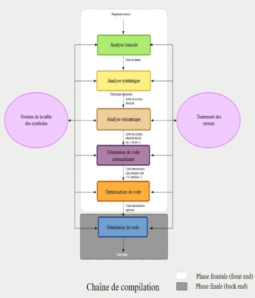
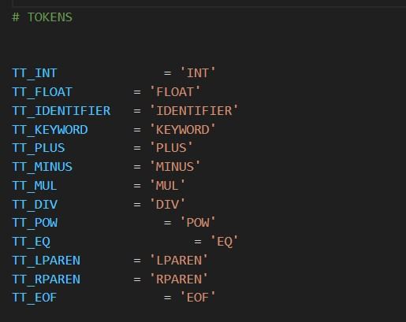
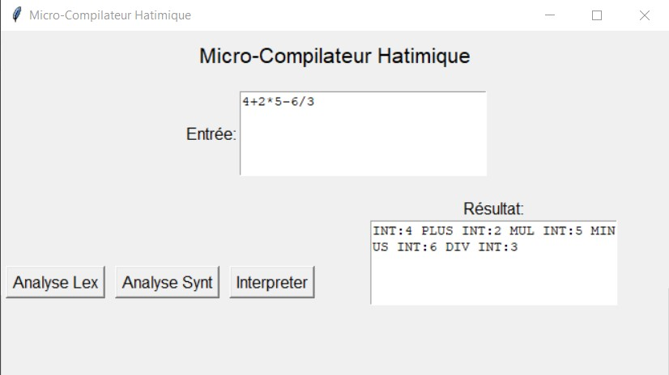
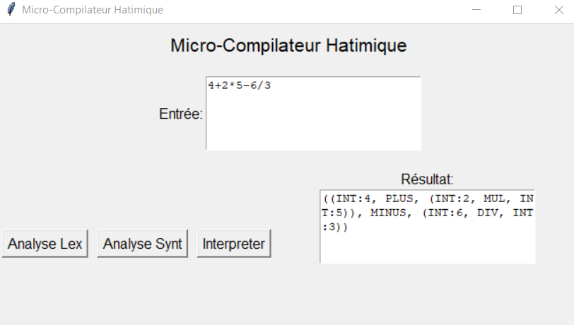
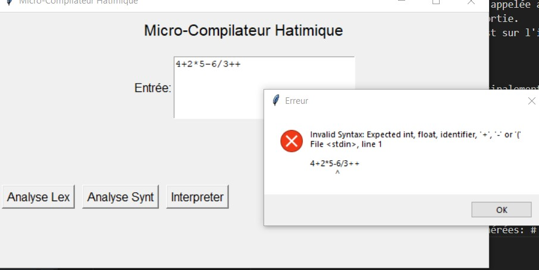
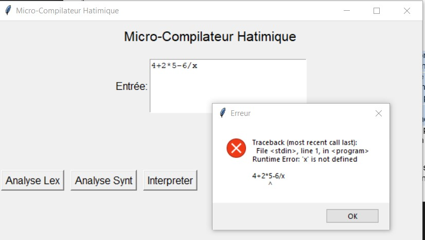

# INTRODUCTION :

After acquiring the compilation technique course, I, as a student in the 2nd year of the DATA AND SOFTWARE ENGINEERING sector, I carried out this work which consists in making a micro compiler based on the PYTHON language which consists of four dependent phases:

1-Lexical analysis
2-Syntactic analysis
3-Semantic analysis
4-Interpreter
                                          

# WHAT IS A COMPILATOR?

A compiler is simply a program that reads a text file of source code written in a programming language and produces code
assembler for the target computer architecture. It is usually divided into several modules, which are described in the data flow diagram on the right. This diagram describes all the steps necessary to convert high-level language source code into assembly code for a target machine. All modules use a shared data structure called Symbol Tables (more on this later) and have their own routines for handling symbols.
errors.
Here is an image that sums it all up: 

# LEXICAL ANALYZER PHASE:
The very first step is to divide the input program code into a group of semantically meaningful units called Tokens. Intuitively, each word and symbol in the source code conveys meaning and we want to extract these lexical units into an ordered list for further processing. It's also the lexical analyzer's job to get rid of code comments. The lexical analyzer output for our sample program would look like that shown in the image. #
Attached is an execution text: #
By clicking on Lexical Analysis, the result is displayed directly;

# SYNTAX ANALYZER PHASE:
The parser is the heart of the compiler. It calls other modules, such as the lexical analyzer to retrieve the following lexical units, and acts as the main loop of the compiler. It receives the stream of tokens from the parser as input and
produces a data structure called a syntax tree (abstract syntax tree) as output.
Here is an image demonstrating the test on the GUI:
#

# SEMANTIC ANALYZER PHASE:
The semantic analyzer mainly reports errors to help the programmer correct errors. On top of that, it updates the identifier types in the symbol table, which is valuable knowledge for the code generator later.
The error checking part is not required, but highly recommended because the behavior of the compiled program may be undefined if, for example, we allow more arguments to be passed to a function than it is designed to handle. We finish
probably by overwriting something in memory and this is generally not a good sign for correct program behavior.
Here are examples of the errors generated: #
#

#  CONCLUSION :
This project allowed me to perfectly understand the chain of
compiling a code gave us the opportunity to discover
a lot of problems, to resolve them over time and
clear up some ambiguities.

The experience was very interesting not only did it
allowed to move from the theoretical part to the practical part but
also to train and open the door to the infinite world of programming.
